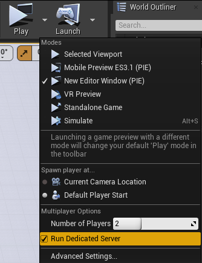
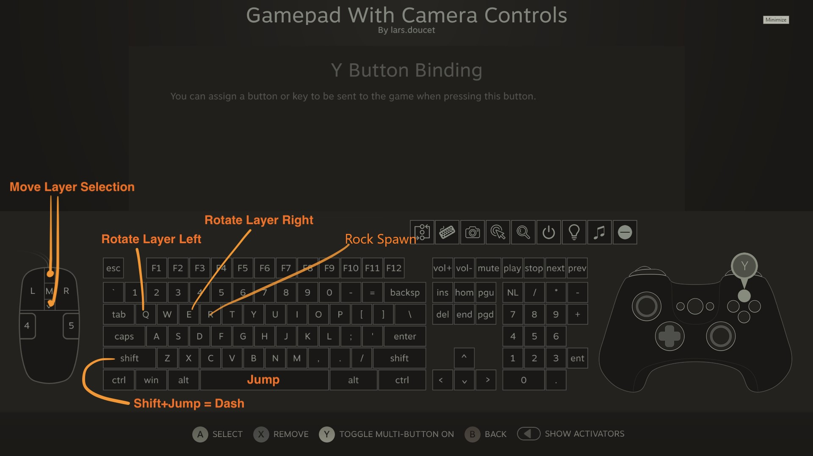

# TowerOfBabelMP

Setup:

1. Edit > Project Settings > Maps & Modes > Default GameMode: **BP_GameMode**
2. Edit > Project Settings > Maps & Modes > Selected GameMode > Default Pawn Class:  **BP_Player**
3. Edit > Project Settings > Maps & Modes > Editor Startup Map: **Main**
4. Edit > Project Settings > Maps & Modes > Game Default Map: **Main**

To Start:

1.

2. on CLIENT 1: check Local and Session  
on CLIENT 2 click wait for game session to load in list above, click refresh if needed,
 then click join.

Controls:

